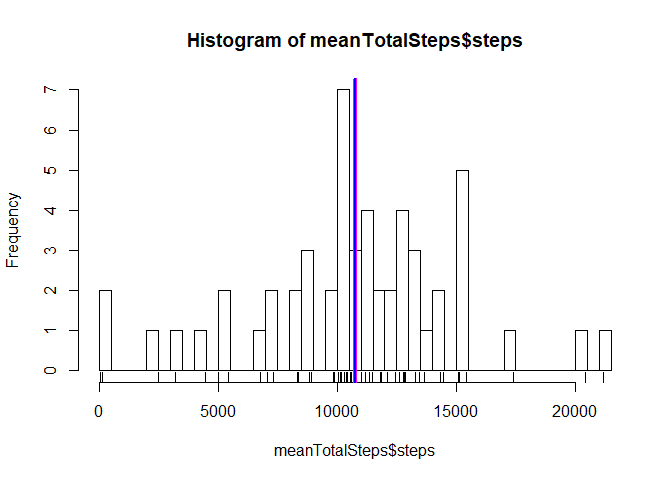
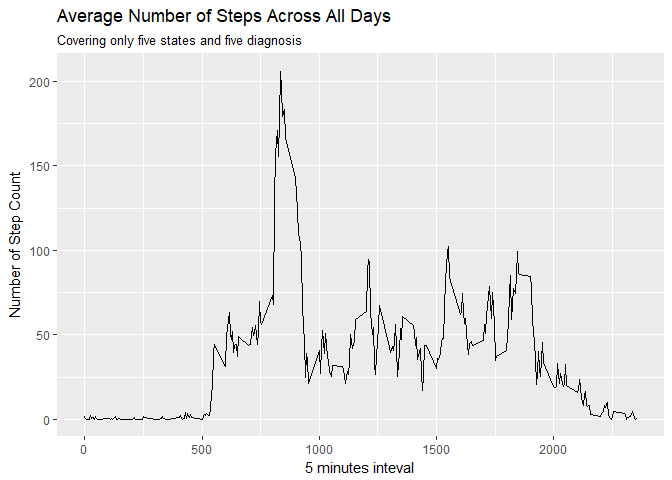
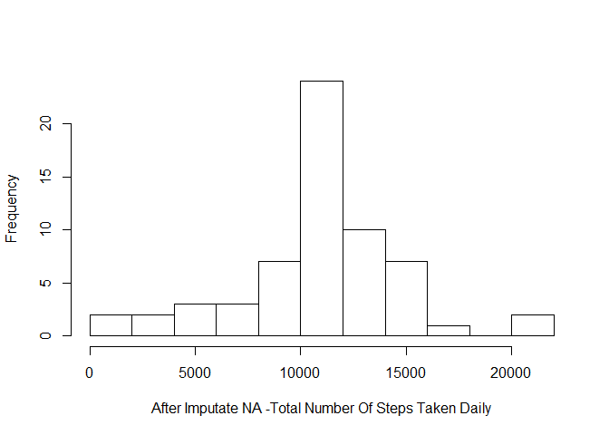
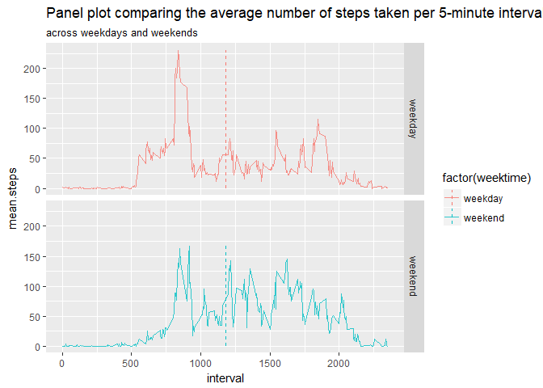
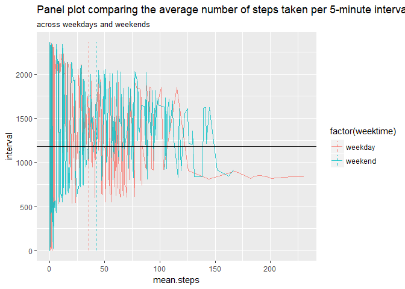
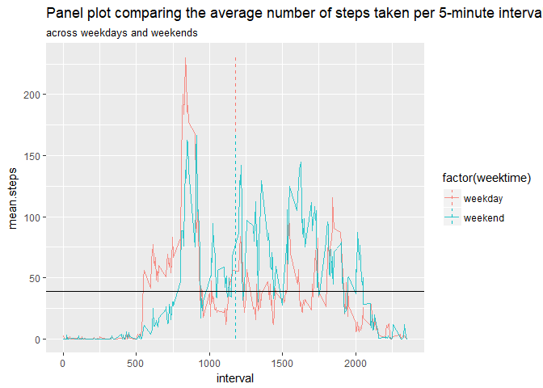

Assignment week 2, Reproducible Research from JHU on Coursera
-------------------------------------------------------------

It is now possible to collect a large amount of data about personal movement using activity monitoring devices such as a Fitbit, Nike Fuelband, or Jawbone Up. These type of devices are part of the “quantified self” movement – a group of enthusiasts who take measurements about themselves regularly to improve their health, to find patterns in their behavior, or because they are tech geeks. But these data remain under-utilized both because the raw data are hard to obtain and there is a lack of statistical methods and software for processing and interpreting the data.

This assignment makes use of data from a personal activity monitoring device. This device collects data at 5 minute intervals through out the day. The data consists of two months of data from an anonymous individual collected during the months of October and November, 2012 and include the number of steps taken in 5 minute intervals each day.

### 1. Code for reading in the dataset and/or processing the data

The data for this assignment can be downloaded from the course web site: <https://d396qusza40orc.cloudfront.net/repdata%2Fdata%2Factivity.ziphttp://rmarkdown.rstudio.com>[link](https://d396qusza40orc.cloudfront.net/repdata%2Fdata%2Factivity.ziphttp://rmarkdown.rstudio.com).

``` r
activity <- read.csv("activity.csv")
dim(activity)
```

    ## [1] 17568     3

create new dataset without na values

``` r
nactivity <- na.omit(activity)
meanTotalSteps <- aggregate(nactivity$steps, list(nactivity$date), sum)
names(meanTotalSteps) <- c("date", "steps")
meanTotalSteps
```

    ##          date steps
    ## 1  2012-10-02   126
    ## 2  2012-10-03 11352
    ## 3  2012-10-04 12116
    ## 4  2012-10-05 13294
    ## 5  2012-10-06 15420
    ## 6  2012-10-07 11015
    ## 7  2012-10-09 12811
    ## 8  2012-10-10  9900
    ## 9  2012-10-11 10304
    ## 10 2012-10-12 17382
    ## 11 2012-10-13 12426
    ## 12 2012-10-14 15098
    ## 13 2012-10-15 10139
    ## 14 2012-10-16 15084
    ## 15 2012-10-17 13452
    ## 16 2012-10-18 10056
    ## 17 2012-10-19 11829
    ## 18 2012-10-20 10395
    ## 19 2012-10-21  8821
    ## 20 2012-10-22 13460
    ## 21 2012-10-23  8918
    ## 22 2012-10-24  8355
    ## 23 2012-10-25  2492
    ## 24 2012-10-26  6778
    ## 25 2012-10-27 10119
    ## 26 2012-10-28 11458
    ## 27 2012-10-29  5018
    ## 28 2012-10-30  9819
    ## 29 2012-10-31 15414
    ## 30 2012-11-02 10600
    ## 31 2012-11-03 10571
    ## 32 2012-11-05 10439
    ## 33 2012-11-06  8334
    ## 34 2012-11-07 12883
    ## 35 2012-11-08  3219
    ## 36 2012-11-11 12608
    ## 37 2012-11-12 10765
    ## 38 2012-11-13  7336
    ## 39 2012-11-15    41
    ## 40 2012-11-16  5441
    ## 41 2012-11-17 14339
    ## 42 2012-11-18 15110
    ## 43 2012-11-19  8841
    ## 44 2012-11-20  4472
    ## 45 2012-11-21 12787
    ## 46 2012-11-22 20427
    ## 47 2012-11-23 21194
    ## 48 2012-11-24 14478
    ## 49 2012-11-25 11834
    ## 50 2012-11-26 11162
    ## 51 2012-11-27 13646
    ## 52 2012-11-28 10183
    ## 53 2012-11-29  7047

### 2. Histogram of the total number of steps taken each day, mean line in magenta, median line in blue, median=mean in our example

``` r
lmts <- nrow(meanTotalSteps)
hist(meanTotalSteps$steps, breaks = lmts)
rug(meanTotalSteps$steps)
abline(v = mean(meanTotalSteps$steps), col = "magenta", lwd = 4)
abline(v = median(meanTotalSteps$steps), col = "blue", lwd = 2)
```



### 3. Mean and median number of steps taken each day

``` r
mean(meanTotalSteps$steps)
```

    ## [1] 10766.19

``` r
median(meanTotalSteps$steps)
```

    ## [1] 10765

### 4. Time series plot of the average number of steps taken

``` r
library(plyr)
#calculate average steps for each of 5-minute inteval during a 24-hour period
int.mean.steps <- ddply(nactivity, ~interval, summarise, mean = mean(steps))
```

``` r
library(ggplot2)
ggplot(data = int.mean.steps, aes(x=interval, y=mean)) +
    geom_line() + 
    labs(title = "Average Number of Steps Across All Days", 
         subtitle = "Covering only five states and five diagnosis", 
         x="5 minutes inteval", y="Number of Step Count")
```



### 5. The 5-minute interval that, on average, contains the maximum number of steps

``` r
int.mean.steps[which.max(int.mean.steps$mean),]
```

    ##     interval     mean
    ## 104      835 206.1698

**Observations**

Based on steps taken pattern, the person's daily activity peaks around 8:35am

### 6. Code to describe and show a strategy for imputing missing data

Calculate and report the total number of missing values in the dataset

``` r
library(sqldf)
```

    ## Loading required package: gsubfn

    ## Loading required package: proto

    ## Loading required package: RSQLite

``` r
tNA <- sqldf('SELECT d.* 
        FROM "activity" as d
        WHERE d.steps IS NULL 
        ORDER BY d.date, d.interval')
```

``` r
nrow(tNA)
```

    ## [1] 2304

Filling the missing values

``` r
t1 <- sqldf('
        SELECT d.*, i.mean 
        FROM "int.mean.steps" as i 
        JOIN "activity" as d 
        ON d.interval = i.interval 
        ORDER BY d.date, d.interval ')

t1$steps[is.na(t1$steps)] <- t1$mean[is.na(t1$steps)]
```

### 7. Histogram of the total number of steps taken each day after missing values are imputed

``` r
t1.total.steps <- as.integer( sqldf('
        SELECT sum(steps) 
        FROM t1') )
        
t1.total.steps.by.date <- sqldf('
        SELECT date, sum(steps) as "t1.total.steps.by.date" 
        FROM t1 GROUP BY date 
        ORDER BY date')
        
daily.61.steps <- sqldf('
        SELECT date, "t1.total.steps.by.date" as "steps" 
        FROM "t1.total.steps.by.date" 
        ORDER BY date')
```

Make an histogram of the total number of steps every day

``` r
hist(daily.61.steps$steps,
        main=" ", 
        breaks=10, 
        xlab="After Imputate NA -Total Number Of Steps Taken Daily")
```



Calculate and report the mean and median total number of steps taken per day

``` r
t1.mean.steps.per.day <- as.integer(t1.total.steps / NROW(t1.total.steps.by.date))
t1.mean.steps.per.day
```

    ## [1] 10766

``` r
t1.median.steps.per.day <- median(t1.total.steps.by.date$t1.total.steps.by.date)
t1.median.steps.per.day
```

    ## [1] 10766.19

**Observation**

Do these values (mean and median) differ from the estimates from the first part of the assignment? Not really

What is the impact of imputing missing value on the estimates of the total daily number of steps? The shape of the histogram remains the same as the histogram from removed missing values. However, the frequency counts increased as expected.

### 8. Panel plot comparing the average number of steps taken per 5-minute interval across weekdays and weekends

``` r
t1$date <- as.Date(t1$date)
t1$weektime <- as.factor(ifelse(weekdays(t1$date) %in%
                    c("samedi", "dimanche"), "weekend", "weekday"))
        
t5 <- sqldf('
        SELECT interval, avg(steps) as "mean.steps", weektime             
        FROM t1 
        GROUP BY weektime, interval 
        ORDER BY interval')
```

``` r
library(dplyr)
```

    ## Warning: package 'dplyr' was built under R version 3.4.2

    ## 
    ## Attaching package: 'dplyr'

    ## The following objects are masked from 'package:plyr':
    ## 
    ##     arrange, count, desc, failwith, id, mutate, rename, summarise,
    ##     summarize

    ## The following objects are masked from 'package:stats':
    ## 
    ##     filter, lag

    ## The following objects are masked from 'package:base':
    ## 
    ##     intersect, setdiff, setequal, union

``` r
lines <- t5 %>%
    group_by(weektime) %>%
    summarise(
        x = mean(mean.steps),
        ymin = min(interval),
        ymax = max(interval),
        
        #2
        y = mean(interval),
        ymin2 = min(mean.steps),
        ymax2 = max(mean.steps)
    )

ggplot(data = t5, 
       aes(x = interval, y = mean.steps, colour = factor(weektime)))  + 
    geom_line(alpha = 0.8) + 
    labs(title = "Panel plot comparing the average number of steps taken per 5-minute interval", 
         subtitle = "across weekdays and weekends") + 
    geom_linerange(aes(x=y, y=NULL, ymin=ymin2, ymax=ymax2), 
                   data=lines, linetype="dashed") + 
    facet_grid(factor(weektime) ~ .)
```



``` r
ggplot(data = t5, 
       aes(x = mean.steps, y = interval, colour = factor(weektime)))  + 
    geom_line(alpha = 0.8) + 
    labs(title = "Panel plot comparing the average number of steps taken per 5-minute interval", 
         subtitle = "across weekdays and weekends") + 
    geom_hline(aes(yintercept = mean(interval))) +
    geom_linerange(aes(x=x, y=NULL, ymin=ymin, ymax=ymax), 
                   data=lines, linetype="dashed")
```



``` r
ggplot(data = t5, 
       aes(x = interval, y = mean.steps, colour = factor(weektime)))  + 
    geom_line(alpha = 0.8) + 
    labs(title = "Panel plot comparing the average number of steps taken per 5-minute interval", 
         subtitle = "across weekdays and weekends") + 
    geom_hline(aes(yintercept = mean(mean.steps))) +
    geom_linerange(aes(x=y, y=NULL, ymin=ymin2, ymax=ymax2), 
                   data=lines, linetype="dashed")
```


